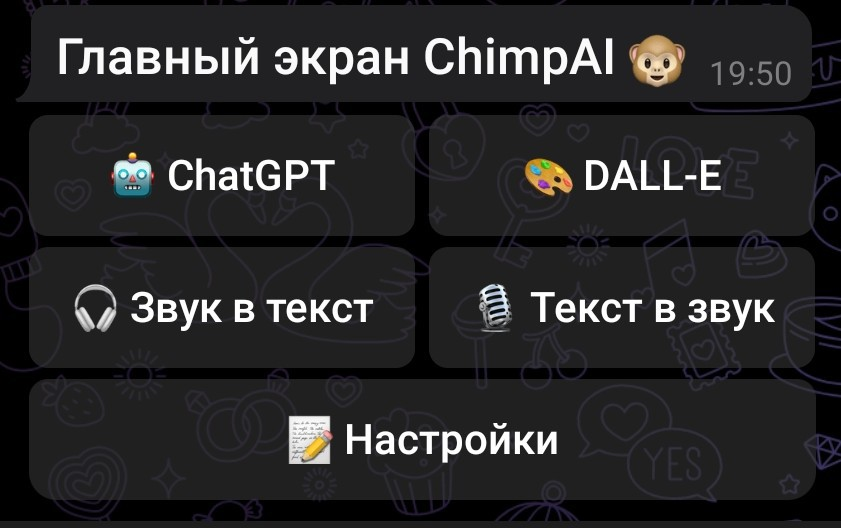
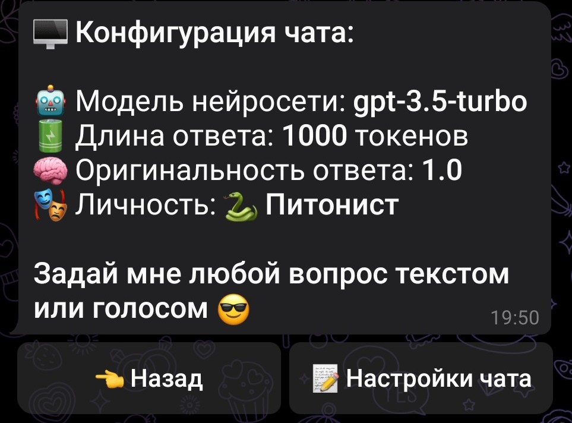
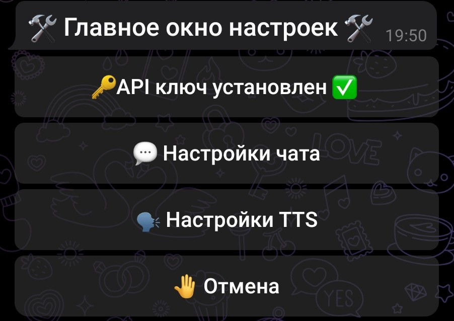
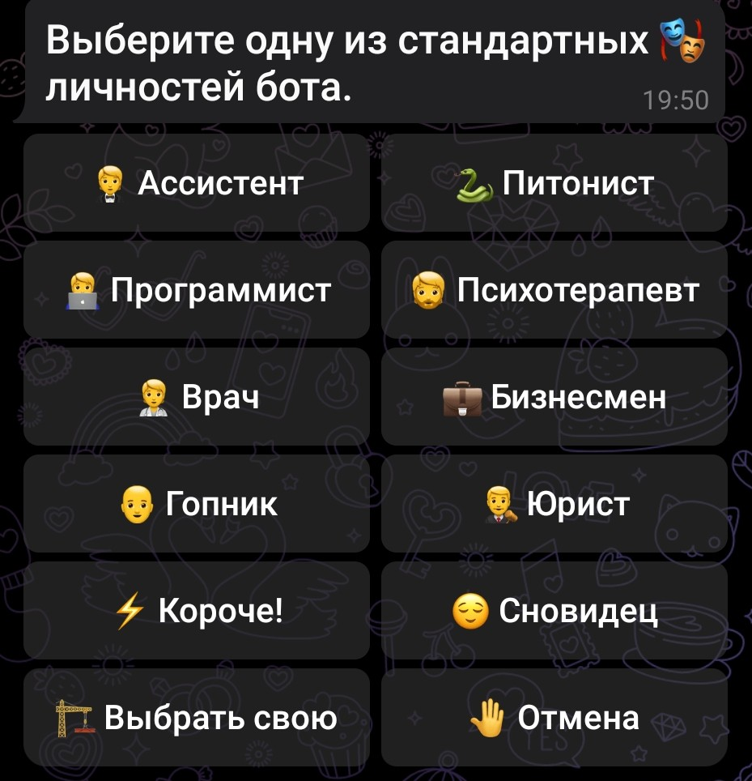

# chimpai bot 🐵

**ChimpAI - это Telegram бот для OpenAI API.**

1. Для работы использует ключ OpenAI API
2. Поддерживает текстовый и голосовой ввод
3. Содержит несколько преднастроек запросов (личностей)
4. Поддерживает пользовательские личности
5. Умеет транскрибировать голосовые сообщения в текст (Speech-to-Text)
6. Умеет создавать голосовые сообщения из текста (Text-to-Speech)
7. Использует Dall-E 3 для создания изображений

## Как начать пользоваться ботом?

Клонируйте репозиторий, заполните .env, соберите и запустите контейнер

### 1. Клонируйте репозиторий

```bash
git clone https://github.com/hermanguilliman/chimpai_bot.git
```

### 2. Заполните переменные в .env файле

```bash
cp .env.example .env
nano .env
```

### 3. Соберите и запустите проект

```bash
docker-compose up -d --build
```

[](screenshots/1.jpg)
[](screenshots/2.jpg)
[](screenshots/3.jpg)
[](screenshots/4.jpg)
